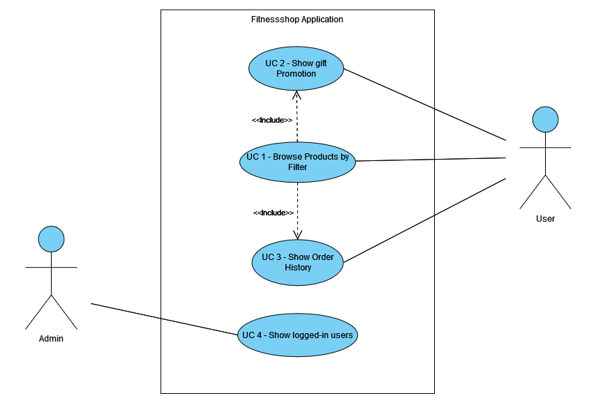

# FitnessOnlineShop_BeFIT

This is the repository for a web application designed to provide an easy and user-friendly shopping experience for a successful fitness journey. The application is a student project, developed for the module *Internet Technology FS24* by Katja, Sedat, Cem & Susmy.

The website provides various fitness clothes, equipment and nutritions. The products can be filtered by various attributes and added to a shopping cart.

The web shop contains the following pages:
1. Home
2. Login
3. Register
4. About Us

[](http://www.apache.org/licenses/LICENSE-2.0.html)

#### Contents:
- [Analysis](#analysis)
  - [Scenario](#scenario)
  - [User Stories](#user-stories)
  - [Use Case](#use-case)
- [Design](#design)
  - [Prototype Design](#prototype-design)
  - [Domain Design](#domain-design)
  - [Business Logic](#business-logic)
- [Implementation](#implementation)
  - [Backend Technology](#backend-technology)
  - [Frontend Technology](#frontend-technology)
- [Project Management](#project-management)
  - [Roles](#roles)
  - [Milestones](#milestones)

## Analysis
> 💥What does the template mean with "🚧: You can reuse the analysis (you made) from other projects (e.g., requirement engineering), but it must be submitted according to the following template."?
Shall we insert a table with different requirements (as below)? Or how should we integrate them?💥

|:No:|:Ref:|:Title:|:Description:|
|---|---|---|---|
|R1||one|first|
|R2||two|second|
|R3|R1|three|third|

### Scenario
> 💥Is the text from us sufficient enough?💥

FitnessOnlineShop "BeFIT" is a webshop that provides different functionalities for users (customer) and the admin for the usage and management of the webshop. 

### User Stories

Admin:
1. As an Admin, I want to be able to add new products to the catalog.
2. As an Admin, I want to edit and remove products from the catalog.
3. As an Admin, I want to list all users registered on the plattform (and other views of business data?).
4. As an Admin, I want to delete a user account if necessary.

User:
1. As an User, I want to be able to register on the platform.
2. As an User, I want to browse products by filters.
3. As an User, I want to view detailed product descriptions and additional information about the product.
4. As an User, I want to see my order history.

### Use Case



- UC-1 [Browse through products by filters]: User can browse through the products by filters
- UC-2 [Show gift promotion]: Users can receive a gift with a certain order value.
- UC-3 [Show order history]: User can retrieve the information about his order history.
- UC-4 [Show logged-in users]: Admin can retrieve all the logged-in users.  

---------------------------------------------------------------
**_Template Content from Reference Project_**

## Design
> 🚧: Keep in mind the Corporate Identity (CI); you shall decide appropriately the color schema, graphics, typography, layout, User Experience (UX), and so on.

### Wireframe
> 🚧: It is suggested to start with a wireframe. The wireframe focuses on the website structure (Sitemap planning), sketching the pages using Wireframe components (e.g., header, menu, footer) and UX. You can create a wireframe already with draw.io or similar tools. 

Starting from the home page, we can visit different pages. Available public pages are visible in the menu...

### Prototype
> 🚧: A prototype can be designed using placeholder text/figures in Budibase. You don't need to connect the front-end to back-end in the early stages of the project development.

### Domain Design
> 🚧: Provide a picture and describe your domain model; you may use Entity-Relationship Model or UML class diagram. Both can be created in Visual Paradigm - we have an academic license for it.

The `ch.fhnw.pizza.data.domain` package contains the following domain objects / entities including getters and setters:


### Business Logic 
> 🚧: Describe the business logic for **at least one business service** in detail. If available, show the expected path and HTPP method. The remaining documentation of APIs shall be made available in the swagger endpoint. The default Swagger UI page is available at /swagger-ui.html.

Based on the UC-4, there will be two offers and a standard offer. Given a location, a message is shown accordingly:

- If the location is "Basel", the message is "10% off on all large pizzas!!!"
- If the location is "Brugg", the message is "two for the price of One on all small pizzas!!!"
- Otherwise, the message is "No special offer".

**Path**: [`/api/menu/?location="Basel"`] 

**Param**: `value="location"` Admitted value: "Basel","Brugg".

**Method:** `GET`

## Implementation
> 🚧: Briefly describe your technology stack, which apps were used and for what.

### Backend Technology
> 🚧: It is suggested to clone this repository, but you are free to start from fresh with a Spring Initializr. If so, describe if there are any changes to the PizzaRP e.g., different dependencies, versions & etc... Please, also describe how your database is set up. If you want a persistent or in-memory H2 database check [link](https://github.com/FHNW-INT/Pizzeria_Reference_Project/blob/main/pizza/src/main/resources/application.properties). If you have placeholder data to initialize at the app, you may use a variation of the method **initPlaceholderData()** available at [link](https://github.com/FHNW-INT/Pizzeria_Reference_Project/blob/main/pizza/src/main/java/ch/fhnw/pizza/PizzaApplication.java).

This Web application is relying on [Spring Boot](https://projects.spring.io/spring-boot) and the following dependencies:

- [Spring Boot](https://projects.spring.io/spring-boot)
- [Spring Data](https://projects.spring.io/spring-data)
- [Java Persistence API (JPA)](http://www.oracle.com/technetwork/java/javaee/tech/persistence-jsp-140049.html)
- [H2 Database Engine](https://www.h2database.com)

To bootstrap the application, the [Spring Initializr](https://start.spring.io/) has been used.

Then, the following further dependencies have been added to the project `pom.xml`:

- DB:
```XML
<dependency>
			<groupId>com.h2database</groupId>
			<artifactId>h2</artifactId>
			<scope>runtime</scope>
</dependency>
```

- SWAGGER:
```XML
   <dependency>
      <groupId>org.springdoc</groupId>
      <artifactId>springdoc-openapi-starter-webmvc-ui</artifactId>
      <version>2.3.0</version>
   </dependency>
```

### Frontend Technology
> 🚧: Describe your views and what APIs is used on which view. If you don't have access to the Internet Technology class Budibase environment(https://inttech.budibase.app/), please write to Devid on MS teams.

This Web application was developed using Budibase and it is available for preview at https://inttech.budibase.app/app/pizzeria. 

## Execution
> 🚧: Please describe how to execute your app and what configurations must be changed to run it. 

The codespace URL of this Repo is subject to change. Therefore, the Budibase PizzaRP webapp is not going to show any data in the view, when the URL is not updated or the codespace is offline. Follow these steps to start the webservice and reconnect the webapp to the new webservice url. 

> 🚧: This is a shortened description for example purposes. A complete tutorial will be provided in a dedicated lecture.

1. Clone PizzaRP in a new repository.
2. Start your codespace (see video guide at: [link](https://www.youtube.com/watch?v=_W9B7qc9lVc&ab_channel=GitHub))
3. Run the PizzaRP main available at PizzaApplication.java on your own codespace.
4. Set your app with a public port, see the guide at [link](https://docs.github.com/en/codespaces/developing-in-a-codespace/forwarding-ports-in-your-codespace).
5. Create an own Budibase app, you can export/import the existing Pizzeria app. Guide available at [link](https://docs.budibase.com/docs/export-and-import-apps).
6. Update the pizzeria URL in the datasource and publish your app.

## Project Management
> 🚧: Include all the participants and briefly describe each of their **individual** contribution and/or roles. Screenshots/descriptions of your Kanban board or similar project management tools are welcome.

### Roles
- Back-end developer: Charuta Pande 
- Front-end developer: Devid Montecchiari

### Milestones
1. **Analysis**: Scenario ideation, use case analysis and user story writing.
2. **Prototype Design**: Creation of wireframe and prototype.
3. **Domain Design**: Definition of domain model.
4. **Business Logic and API Design**: Definition of business logic and API.
5. **Data and API Implementation**: Implementation of data access and business logic layers, and API.
6. **Security and Frontend Implementation**: Integration of security framework and frontend realisation.
7. (optional) **Deployment**: Deployment of Web application on cloud infrastructure.


#### Maintainer
- Charuta Pande
- Devid Montecchiari

#### License
- [Apache License, Version 2.0](blob/master/LICENSE)
